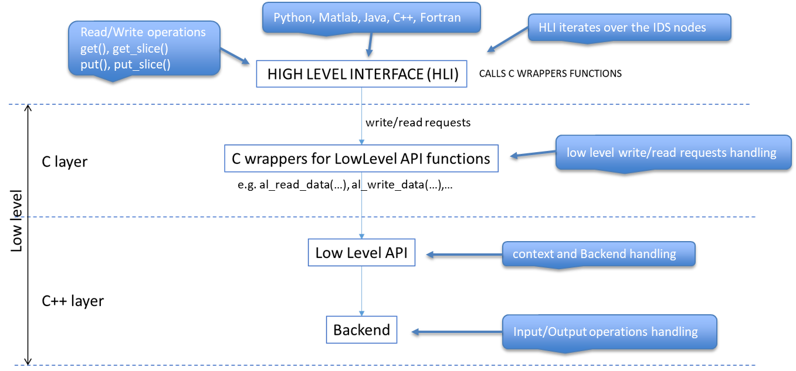

Development guide
=================

IMAS access layer repositories
------------------------------

The IMAS access layer consists of a number of components which are developed in separate
repositories:

-   `IMAS-Core <https://github.com/iterorganization/IMAS-Core>`__: the
    IMAS core repository, MDSplus model generator and Python lowlevel
    bindings.

Dependencies:

-   `data-dictionary
    <https://github.com/iterorganization/IMAS-Data-Dictionary>`__: the IMAS Data
    Dictionary definitions, used for generating MDSplus models and end-user APIs in 
    Fortran, C++, Java and Matlab.

The documentation on this page covers IMAS-Core build and installation.

Development environment
-----------------------
See the :ref:`user build prerequisites` section in the :doc:`../user_guide/installation` guide for an overview of modules you need to load
when on SDCC or packages to install when using Ubuntu 22.04.

Architecture
------------

`Figure 1`_ depicts the layered AL architecture model. It comprises
the upper end-user APIs in Fortran, C++, Java and Matlab and the so-called Low Level (LL),
which receiveens-user APIs requests. The LL includes a C layer with C functions
(wrappers) for calling the functions of the (C++) LL API located in the
C++ layer of the LL.

   **Figure 1:** Layered AL architecture model

When calling an AL API function (``get()``/``get_slice()``, ``put()``/``put_slice()``),
theens-user API iterates over all nodes of the IDS where each visited node is
either a scalar, or an array (with dimensions from 1 to 6) or an array
of structures.

Distinguishing Read and Write operations, we have two use-cases:

-  When calling ``get()``/``get_slice()``, theens-user API calls the LL for each visited
   node, passing the data contained in the node (scalar or array), the
   parameters which define the dimension(s), the shape(s) of the data
   and the identifier (path) of the node. Then the LL calls the backend,
   which returns the data to the LL, which in turn returns the data
   (allocated pointers) to theens-user API.

-  When calling ``put()``/``put_slice()``, theens-user API calls the LL for each node,
   passing a pointer to the data to be written, the parameters which
   define the dimension(s), the shape(s) of the data and the identifier
   (path) of the node. Then the LL calls the backend, which writes the
   data to some storage.

Tests
-----

You will find tests in the `tests` directory. The tests are written to test diiferent backends like MDSPLUS, HDF5, ASCII, Memory and UDA.
It writes and reads data from the backends and checks if the data is written and read correctly.

CMake
-----

We're using CMake for the build configuration. See `the CMake documentation
<https://cmake.org/cmake/help/latest/>`__ for more details about CMake.

The ``FetchContent`` CMake module for making dependencies from other repositories
available. For more information on this module we refer to the
`FetchContent CMake documentation
<https://cmake.org/cmake/help/latest/module/FetchContent.html>`__

Documentation overview
----------------------

The documentation is generated with Sphinx which you can find in `docs` directory. 
Code documentation is generated using doxygen and configured in Makefile of Sphinx. 
For more information on Sphinx, see the `Sphinx docs
<https://www.sphinx-doc.org/en/master/>`__ and the `documentation of the theme
(sphinx-immaterial) that we're using
<https://jbms.github.io/sphinx-immaterial/index.html>`__.

``docs`` folder contains the configuration (``conf.py``), and documentation pages (``*.rst``).

Building the documentation
''''''''''''''''''''''''''

For building documentation, you need to have the following dependencies installed:
- Python 
- Doxygen

.. code-block:: console
    :caption: Example: building the documentation for the Pythonens-user API

    $cd IMAS-Core
    # Create and activate a venv
    rm -rf docs_venv
    python -m venv docs_venv
    . docs_venv/bin/activate

    # Install dependencies
    pip install --upgrade pip
    pip install -r docs/requirements.txt

    export SPHINXOPTS='-n --keep-going'

    make -C docs html

Publish IMAS-Core on pypi
-------------------------

We are using Github Actions to publish the IMAS-Core package on pypi. The configuration is in ``.github/workflows/pypi.yml``.

Documentation Github Actions:

Documentation is built using Github Actions. The configuration is in ``.github/workflows/docs.yml``.
We are using readthedocs for the documentation. The documentation is built on every push to the main branch.
